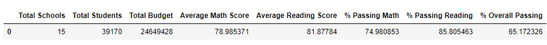
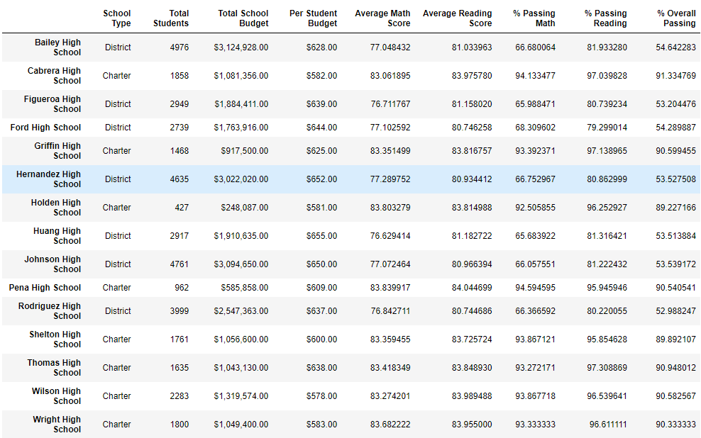
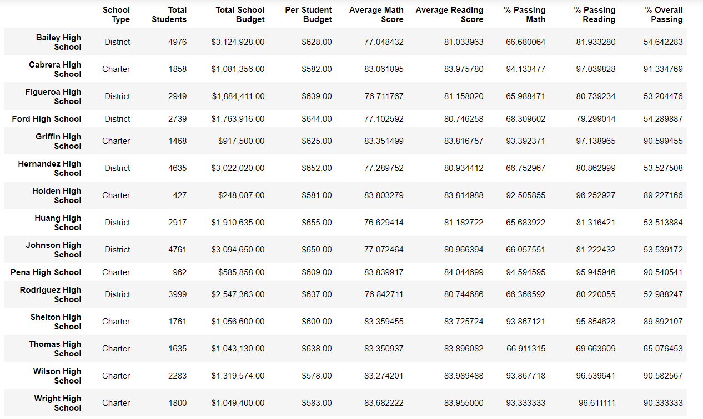

# School_District_Analysis

## Background
A school district's chief data analyst has asked for assistance in analyzing standardized testing data. Maria has asked to have the data aggregated and to show school performance trends in math and reading. The initial analysis will assist the school board and superintendent in making decisions regarding the school budget allotments and priorities. After reviewing the initial analysis, the school board has concluded that there is evidence of academic dishonesty, specifically when looking at Thomas High School ninth graders’ test scores. In order to uphold state-testing standards, the school board has reached out for assistance. The school district analysis is to be repeated after removing the math and reading scores for Thomas High School ninth-graders to determine how it will affect the school performance. 

### Resources
Data Source:
PyCitySchools.ipynb file

Software: 
Python 3.7.6
Jupyter Notebook 6.4.8
Ipykernel 6.9.1
Anaconda 4.13.0

## Analysis

### District Summary
In the original analysis, a district school summary analysis was performed and displayed. It is not anticipated for the distr This may be due to the small number of 9th-grade students at Thomas High School. Using the count() method, the total number of students in the 9th grade at Thomas High School is 461. Using the same method, the total student count for all schools came to 39170. Therefore, 461 students are not expected to make a drastic difference in the district summary report. As such, the district summary report was reduced only by 0.1%.

#### Original District Summary

#### Adjusted District Summary

### School Summary

Looking at the per school summary report, we can conclude the following about Thomas High School:
- The “Overall Passing Percentage” is high at 91%
- The percentage passing math was 93%
- The percentage passing reading was 97%

#### Original School Summary

#### Adjusted School Summary

In order to look into the suspected academic dishonesty, the grades for Thomas High School ninth-graders were marked as “NaN”. This means the grades are changed to “Not a Number” and excluded from the updated per school summary. 

NINTHGRADEREMOVAL PIC

Once the math and reading scores were removed from the Thomas High School data, we can see drastic changes to the Thomas High School grade:
-	The “% Overall Passing” is significantly decreased to 65.076453.
-	The Passing Math Percentage decreased 67%
-	The Passing Reading Percentage decreased 70% 

By setting the 9th grader’s scores to NaN, the per school summary showed a large difference in the overall scores. Once we fully exclude, or remove, the 9th graders from the scoring, the school summary average increases back to the high percentages.

DISTRICT SUMMARY REMOVED

When reviewing the top five and bottom five schools, both before and after removing the 9th graders, Thomas High School remained the second-best school. The overall order of schools did not change. 

The overall scores by grade level were not altered, except for the 9th-grade scores showing as “NaN”.

Thomas High School has a relatively large budget, landing in the $630-645 per student range. 
- The passing math percentage, passing reading percentage, and the overall passing percentages were not altered when looking at the cleaned data. 
- However, when I removed the whole number formatting, the overall percent passing for that spending range decreased very slightly:

UPDATED SPENDING RANGES AND THE ORIGINAL ONE

The scores by school size also remained the same unless the formatting was removed to see the minimal changes. 

There is also a very slight change to the Charter School passing percentages for all three categories when comparing grades by school type.

Overall, after looking at the adjusted and completed data analysis we can conclude that there have been alterations made to the ninth-grade test scores of Thomas High School. Fortunately, this is a small enough amount that it does not drastically change the overall summary. 

